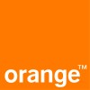

# Resume

1. TOC
{:toc}

## Academic Background

- ### Master Degree
    - Domain: AI 
    - Politehnica University of Bucharest
    - Faculty of Automatic Control and Computers
    - Focus: Unsupervised Domain Adaptation
    - Courses: Deep Neural Networks, Adavanced Techniques in AI, Computer Vision, Knowledge Representation and Reasoning, Multi Agents Systems and *Mathematics for CS*.

- ### Bechelor's Degree
    - Domain: Computer Engineering
    - Politehnica University of Bucharest
    - Faculty of Automatic Control and Computers
    - Focus: AI / Generative Models
    - Thesis: Generative Adversarial Networks for Time Series Forecasting.

## Work experience

Orange Services

- Data Scientist - January 2023 - Present
    - Responsible for creating and maintaining automatic speech recognition systems
- Data Engineer - May 2022 - January 2023
    - I have started a Research Reading Group in which I am responsible for the general direction for each session, present the state of the art and implement different models as alternatives for our business cases solutions. 📰

    - Responsible for end to end GCP data migration pipelines implementation

    - Assist the Data Science Team on integrating the models
    - Working alongside the Research team from France on developing a Dialog State Tracking end to end model as part of my diseartion thesis.

    - Working on improving the performance of speech to text models for Romanian Language with model and dataset quality improvements.

Facultatea de Automatică și Calculatoare, UPB

- Graduate Teaching Assistant  - Sep 2021 - Aug 2022
    - Part of the Artificial Intelligence Lab.
        - Held AI labs & seminaries over the semester.
        - Prepared homework assignments and graded them.
        - Prepared exam subjects (practical and theoretical) and graded them.
    
- Undergraduate Teaching Assistant - Sep 2020 - Sep 2021
    - Part of the Formal Langauges and Automata Theory department.
        - Held Formal Languages Theory seminaries over the semester.
        - Prepared homework assignments (i.e.: a custom language interpreter for Glypho programming language).
        - Graded exam submissions and actively participated in curriculum planning.

Stealth Startup (Undisclosed) 

-  Software Engineer (Full Stack) - Jan 2022 - May 2022
    - Working on a full stack fintech application. 
    - Integrated crypto exchange APIs into the platform
    - Created and maintained the front-end app
    - Integrated different features into the customers flow in order to enhance the user experience

Wave Motion Labs

- Software Engineer - Mar 2021 - Jan 2022
    - Developed a real time Big Data visualisation web application that dynamically renders heterogeneous data in under one second.
    - Coordinate a small front-end engineering team and integrate new features in large scale React application.
    - Developed a customer event ontology in order to track user behaviour on various web platforms based on Apache Kafka streams.
    - Developed data cleaning and data engineering tools for Computer Vision pipelines based on Apache Airflow.
    - Worked on SSR solution for ecommerce platforms based on Jamstack & Gatsby & GraphQL.

NXP Semiconductors

-  Software Engineer Co-op: Nov 2019 - Nov 2020
    -  Create / integrate new drivers / existing drivers into the core of Zephyr OS
    - Create testing environment for specific sample applications using Synopsys VDK, TRACE32 ( debugger ) and networking concepts
    - Working alongside the OS Team for extending the functionalities offered by NXP for Linux Automotive distributions to Zephyr
    - Main programming languages and tools: C, Python [ west ] and Configuration files

Hootsuite

- Frontend Developer Co-op: Jun 2019 - Sep 2019
    - I took part in the process of development of a real tool that will help the front-end team from Bucharest to speed up the React coding. 
    - Most of the time I worked with React & TypeScript and JavaScript for automation scripting. 
    - Create Jenkins cron jobs using Docker 
    - The main project consisted of a React Component that uses Cosmos( server like front-end development tool which uses a large amount of proxies to separate different components in a React project to make them accessible for developers) that acts as an Icon store with copy and paste feature.
    - Main programming languages and tools: TypeScript, React, Docker, Jenkins

Medic Chat

Medic Chat is a Romanian Start-up in e-Health that has the purpose to intermediate the process of classical consultations by using an online portal where medics can answer questions and can give an advice.

- Web developer Co-op
    - Work with the founders at different strategies for improving the monthly number of active users and customers - Develop front-end for the main application using Angular 6     
    - Automate the email process for new customers 
    - Automate the testing process of the web application using Python and Selenium 
    - Main programming languages and tools: TypeScript, Angular, Python

